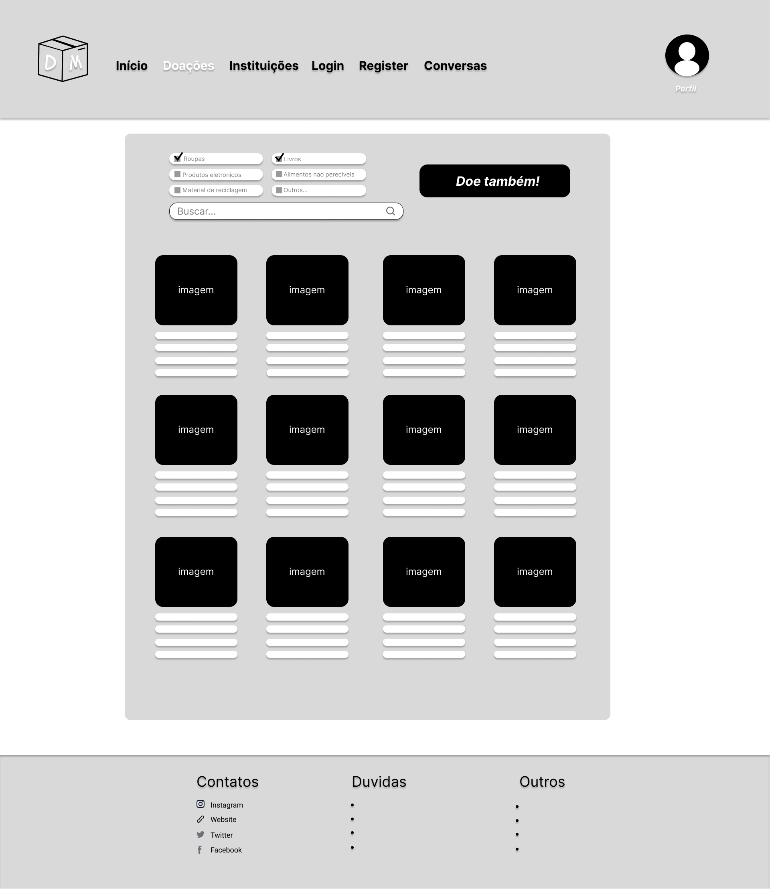
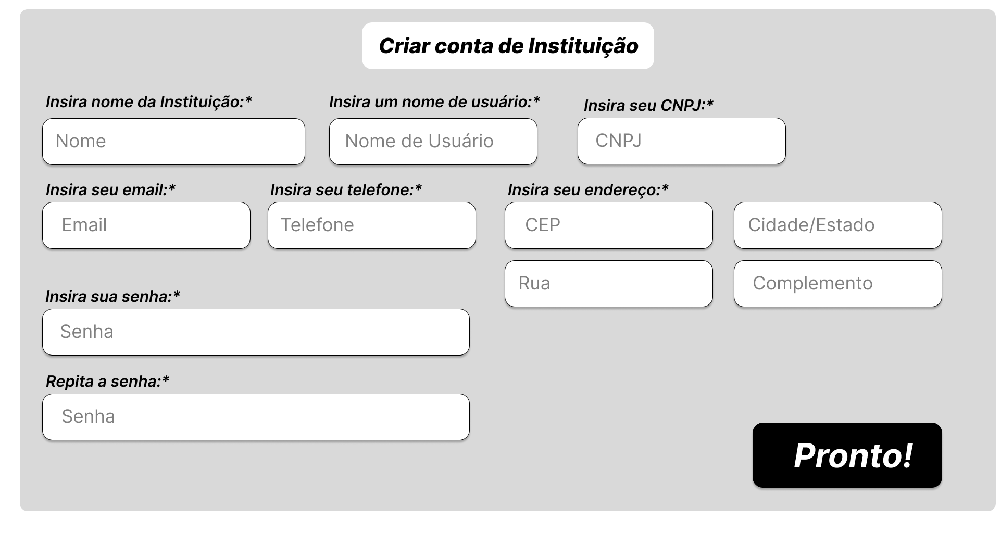

# Informações do Projeto
`TÍTULO DO PROJETO`  

DOE.ME

`CURSO`

CIÊNCIA DA COMPUTAÇÃO (MANHÃ)

TRABALHO INTERDISCIPLINAR I: FRONT-END - 3581100

## Participantes

> Os membros do grupo são: 
> - Catarina França de Moura Castro
> - Thiago Rezende Aguiar
> - Oliver Haas Böttcher
> - Fernando Gonçalves Oliveira Costa
> - Filipe Lorenzato Cardoso Rodrigues
> - Luan Carlos Coelho Garrido
> - Luigi Louback de Oliveira

# Estrutura do Documento

- [Informações do Projeto](#informações-do-projeto)
  - [Participantes](#participantes)
- [Estrutura do Documento](#estrutura-do-documento)
- [Introdução](#introdução)
  - [Problema](#problema)
  - [Objetivos](#objetivos)
  - [Justificativa](#justificativa)
  - [Público-Alvo](#público-alvo)
- [Especificações do Projeto](#especificações-do-projeto)
  - [Personas, Empatia e Proposta de Valor](#personas-empatia-e-proposta-de-valor)
  - [Histórias de Usuários](#histórias-de-usuários)
  - [Requisitos](#requisitos)
    - [Requisitos Funcionais](#requisitos-funcionais)
    - [Requisitos não Funcionais](#requisitos-não-funcionais)
  - [Restrições](#restrições)
- [Projeto de Interface](#projeto-de-interface)
  - [User Flow](#user-flow)
  - [Wireframes](#wireframes)
- [Metodologia](#metodologia)
  - [Divisão de Papéis](#divisão-de-papéis)
  - [Ferramentas](#ferramentas)
  - [Controle de Versão](#controle-de-versão)
- [Projeto da Solução](#projeto-da-solução)
  - [Tecnologias Utilizadas](#tecnologias-utilizadas)
  - [Arquitetura da solução](#arquitetura-da-solução)
- [Avaliação da Aplicação](#avaliação-da-aplicação)
  - [Plano de Testes](#plano-de-testes)
  - [Registros de Testes](#registros-de-testes)
- [Referências](#referências)

# Introdução

## Problema

A aplicação busca resolver a dificuldade de conectar pessoas que querem doar ou reciclar objetos com organizações e indivíduos que precisam desses itens. Muitas vezes, as pessoas não sabem onde podem doar ou reciclar objetos específicos e acabam jogando-os fora, o que contribui para o aumento do lixo e do desperdício. Além disso, há pessoas e organizações que precisam de doações específicas, mas não têm acesso a uma plataforma que facilite essa conexão.

A aplicação será utilizada por pessoas e organizações que querem doar, reciclar ou receber doações de objetos variados. O contexto de uso inclui empresas, organizações sem fins lucrativos e indivíduos que desejam contribuir para a sustentabilidade do meio ambiente e para a melhoria da vida de pessoas necessitadas. As tecnologias utilizadas na aplicação incluem bancos de dados, sistemas de busca, mapas e recursos de comunicação.

## Objetivos

O objetivo geral deste trabalho é desenvolver uma aplicação que facilite e dinamize o processo de doação, reciclagem e reutilização de objetos variados, conectando doadores e beneficiários.

Como objetivos específicos, podem ser listados:
1. Desenvolver um sistema de busca eficiente que permita aos usuários encontrar organizações, pessoas e pontos de coleta específicos para os itens que desejam doar ou reciclar.
2. Permitir que os usuários possam postar pedidos por doações específicas, facilitando a conexão entre doadores e beneficiários e tornando o processo mais dinâmico e interativo.
3. Facilitar o processo de doação de itens que não são mais necessários para seus proprietários, conectando-os com organizações e indivíduos que possam fazer uso dos mesmos, ajudando a reduzir o desperdício e contribuindo para a sustentabilidade ambiental.

Esses objetivos permitirão que a aplicação atenda às necessidades dos usuários de forma eficiente e eficaz, tornando o processo de doação e reciclagem de objetos mais fácil e acessível para todos.

## Justificativa

Segundo o Laboratório de Desigualdades, Pobreza e Mercado de trabalho da PUC-RS, [11,7 milhões de brasileiros entraram em situação de pobreza nos anos de 2020 e 2021, durante a pandemia da COVID 19](https://www.pucrs.br/datasocial/wp-content/uploads/sites/300/2023/02/Estudo-Pobreza-Social-19.01_final.pdf). Isso implica em um aumento de 5,5 pontos percentuais na taxa de pobreza social, que alcançou 30,4% da população. Tal situação é consequência de problemas sociais de complexidade imensa, como a desigualdade social, o preconceito de classe, o racismo, entre outros.

Visto isso, a equipe percebeu a necessidade de busca por soluções. Notou-se que, por mais que a situação estivesse fora do alcance de estudantes universitários, era possível utilizar das habilidades de Programação e Lógica Computacional a fim de possibilitar um caminho que trouxesse benefícios para dois setores sociais distintos: aqueles que precisam se livrar de objetos sem uso em suas casas, e aqueles que passam por dificuldades financeiras e sociais e podem fazer uso desses objetos. Além disso, a ideia de se livrar de objetos permitiu que também fossem implementados funcionalidades relacionados a reciclagem e a reutilização de lixo.

Assim, concretizou-se o Doe.me, a plataforma de comunicação entre doador e beneficente. Por mais que a aplicação em si não seja suficiente para solucionar o problema de desigualdade e de pobreza no Brasil, é um caminho que permite que a própria população tenha ação direta sobre o problema e ainda tenha benefícios ao o fazer.

## Público-Alvo

O público alvo do Doe.me consiste em dois grupos distintos: pessoas que precisam se livrar de objetos sem uso e pessoas que precisam desses objetos devido a dificuldades financeiras e sociais.

* O primeiro grupo abrange pessoas de classe média e de classe alta, homens e mulheres, entre 18 e 70 anos de idade, que estão inseridos minimamente no contexto da internet. Esse público busca se livrar de objetos sem uso em suas casas, a fim de viver uma vida mais organizada e/ou de ajudar pessoas necessitadas.
* O segundo grupo é composto por pessoas de classe baixa, em situação e vulnerabilidade social e/ou de pobreza. São homens e mulheres entre 18 e 70 anos de idade, que devido ao contexto social que estão inseridos, dependem de ajuda financeira e material, e podem usufruir das funcionalidades da aplicação como forma de apoio.
 
# Especificações do Projeto

Nesse projeto, nosso grupo visa, através de um aplicativo de doações, alcançar e ajudar pessoas que precisam ganhar espaço e organização nas suas casas e principalmente, repassar esses itens doados para pessoas que necessitam em suas vidas. Identificamos as dores das pessoas, para saber mais precisamente do que elas precisavam, fizemos isso através de entrevistas com várias cidadãos, pais e mães, homens e mulheres na faixa etária dos seus 35 à 50 anos. Por meio dessas entrevistas, podemos concluir que aquilo que as pessoas mais precisam, é de ajuda para saber como descartar ou doar vários de seus itens que já não são utilizados, como roupas antigas, mobíbilas que já não tem mais espaço em suas casas e também produtos eletrônicos, que necessitam de um tipo de descarte específico. Portanto, atráves do nosso aplicativo doe.me, as pessoas teriam mapas com pontos de descarte nas suas cidades e também poderiam colocar seus itens em forma de "anúncio", assim caso alguém que necessite daquele item, tiver interesse, eles poderam conversar através do chat do aplicativo, facilitando assim sua comunicação e ajudando ambas partes.

## Personas, Empatia e Proposta de Valor

As personas do nosso projeto estão inseridas em diferentes contextos sociais e são exemplos dos dois âmbitos do público alvo, previamente analisado nesse documento. Em seguida, estão os estudos feitos sobre cada uma delas.

### **Persona 1: Vanessa Coutinho**

 

### **Persona 2:Neide Mara**

 

### **Persona 3: Inácio Cintra**
 

## Histórias de Usuários

Com base na análise das personas forma identificadas as seguintes histórias de usuários:

|EU COMO... `PERSONA`| QUERO/PRECISO ... `FUNCIONALIDADE` |PARA ... `MOTIVO/VALOR`                 |
|--------------------|------------------------------------|----------------------------------------|
|Mãe solteira de 2 filhos  | Doar roupas e brinquedos velhos dos meus filhos           | Para organizar melhor a casa               |
|Empregada doméstica       | Apoio financeiro/material                 | Ajudar nas dificuldades financeiras habituais |
|Aposentado preocupado com o meio ambiente       | Uma forma melhor de reciclar meu lixo                 | Ajudar mais o meio ambiente |

## Requisitos

As tabelas que se seguem apresentam os requisitos funcionais e não funcionais que detalham o escopo do projeto.

### Requisitos Funcionais

|ID    | Descrição do Requisito  | Prioridade |
|------|-----------------------------------------|----|
|RF-001| Permitir que o usuário crie uma conta | ALTA | 
|RF-002| Permitir que o usuário realize postagens   | ALTA |
|RF-003| Sistema de chat entre doador e donatário   | ALTA |
|RF-004| Acesso a um mapa com organizações próximas ao usuário   | MÉDIA |
|RF-005| Sistema de categorias/tags  | MÉDIA |

### Requisitos não Funcionais

|ID     | Descrição do Requisito  |Prioridade |
|-------|-------------------------|----|
|RNF-001| O sistema deve ser responsivo para rodar em um dispositivos móvel | MÉDIA | 
|RNF-002| Deve ser visualmente intuitivo, para usuários de maior idade |  ALTA |
|RNF-003| Sistema de recomendações de segurança  | ALTA |
|RNF-004| Aba de informações |  MÉDIA | 
|RNF-005| Limitador de quantas doações um usuário pode receber |  MÉDIA |

## Restrições

O projeto está restrito pelos itens apresentados na tabela a seguir.

|ID| Restrição                                             |
|--|-------------------------------------------------------|
|01| O projeto deverá ser entregue até o final do semestre |
|02| Não pode ser desenvolvido um módulo de backend        |
|03| É preciso ter conhecimento prévio sobre HTML, CSS e JavaScript |
|04| É preciso que instituições que recebem doações concordem em participar do projeto |

# Projeto de Interface

Para a montagem da interface do sistema, estabeleceu-se uma solução com foco em agilidade, acessibilidade e usabilidade, buscando oferecer uma identidade visual padronizada em todas as telas projetadas. Desta forma, o projeto atende aos devidos requisitos trabalhando com a devida responsividade, funcionando em desktops e dispositivos móveis, e com um visual intuitivo, com o objetivo de proporcionar uma experiência satisfatória e eficiente para todos os usuários do sistema.

## User Flow

Conforme fluxo de telas do projeto, apresentado no item anterior, as telas do sistema são apresentadas em detalhes nos itens que se seguem. As telas do sistema apresentam uma estrutura comum, na qual existem 3 grandes blocos, descritos a seguir. São eles:
* **Cabeçalho** - local onde são dispostos elementos fixos de identidade (logo) e navegação principal do site (menu da aplicação);
* **Conteúdo** - apresenta o conteúdo da tela em questão;
* **Rodapé** - apresenta os elementos informativos e de navegação secundária, como informações de contato e redes sociais, links importantes e dúvidas frequentes.

## Wireframes
### Home-Page

### Doações

### Instituições

### Login e Criar Conta

### Conversas

### Perfil do Usuário

### Perfis de Outros Usuários

### Avaliação de Usuários

# Metodologia

A metodologia adotada pelo nosso grupo para o desenvolvimento da aplicação de doações foi baseada em metodologias ágeis, com ênfase na implementação do Framework Scrum.

1. **Processo de Design Thinking:**
Antes de iniciarmos o desenvolvimento da aplicação, passamos por um processo de Design Thinking para entender as necessidades dos usuários e definir os requisitos do produto. Essa fase foi conduzida por todo o grupo que buscou entender o público-alvo do programa.
Durante essa etapa, realizamos entrevistas e coletamos feedbacks. Com base nessas informações, realizamos um brainstorming para gerar ideias e, em seguida, selecionamos as melhores ideias para serem implementadas. Dessa forma, garantimos que a protótipo atendesse às necessidades dos usuários.

2. **Framework Scrum:**
Para gerenciar o desenvolvimento da aplicação, implementamos o Framework Scrum. Definimos o Scrum Master, que será responsável por liderar o processo.
Durante as sprints, realizamos reuniões semanais de acompanhamento do projeto, nas quais discutíamos o andamento das tarefas e possíveis impedimentos. As sprints eram planejadas com base nas listas de prioridades, e a equipe se comprometia a entregar as tarefas planejadas para cada sprint.

3. **Ferramentas:**
Para acompanhar o andamento do projeto e a execução das tarefas, utilizamos o Google Drive e seus Documentos, ferramentas onlines de compartilhamento de textos. Nesse ambiente, criamos um arquivo com as listas "A fazer", "Concluído" e "Projetos Futuros", para acompanharmos o status de cada tarefa.
Para a gestão de configuração do projeto, utilizamos o GitHub. A aplicação foi hospedada no Git, e cada desenvolvedor trabalhava em seu próprio escopo local, adicionando commits antes de fazer o merge com a branch principal. Dessa forma, garantimos que as mudanças feitas por cada desenvolvedor fossem revisadas antes de serem integradas ao código principal.

Ao adotarmos metodologias ágeis como o Scrum, e utilizar ferramentas como o GitHub, conseguimos manter o projeto organizado e com um bom ritmo de desenvolvimento. A gestão de configuração do projeto via GitHub também permitiu que pudéssemos trabalhar de forma colaborativa e garantir a qualidade do código produzido.

## Divisão de Papéis

**Product Owner:** Professores da disciplina 

**Scrum Master:** Catarina F. M. Castro

**Equipe:**
* Thiago Rezende Aguiar
* Oliver Haas Bottcher
* Fernando Gonçalves Oliveira Costa
* Filipe Lorenzato Cardoso Rodrigues
* Luan Carlos Coelho Garrido
* Luigi Louback de Oliveira

## Ferramentas

| Ambiente  | Plataforma              |Link de Acesso |
|:---:      |:---:                    |          :---:|
|Processo de Design Thinking  | Miro |  [https://miro.com](https://miro.com/app/board/uXjVMYD9yIU=/?openNotes) | 
|Repositório de código | GitHub | [https://github.com](https://github.com/ICEI-PUC-Minas-PPLCC-TI/ti-1-ppl-cc-m-20231-doe-me) |  
|Protótipo Interativo | Figma | [https://figma.com](https://www.figma.com/proto/OybBWroxTq8trEZTc0lEaM/TI?node-id=103-2&scaling=min-zoom&page-id=0%3A1&starting-point-node-id=103%3A2) | 
| Editor de Código | Visual Code Studio | [https://code.visualstudio.com](https://code.visualstudio.com/) |
| Plataforma de Comunicação | Discord | [https://discord.com](https://discord.com/) |

As ferramentas empregadas no projeto são:

* Editor de código
* Ferramentas de comunicação
* Ferramentas de diagramação

O Visual Studio Code e o GitHub foram escolhido como plataformas para edição do código devido a sua integração fácil e modelo intuitivo. O discord foi utilizado como ferramenta de comunicação, por causa do sistema de separação de canais de texto e de audio. O Figma foi escolhido como plataforma de criação de wireframes por causa da interface intuitiva e do acesso fácil ao código em CSS. E, por fim, para criar diagramas, foi utilizado o Miro, por causa da capacidade de trabalho em conjunto.

## Controle de Versão

O projeto segue a seguinte convenção para o nome de branchs:

- `master`: versão estável já testada do software
- `unstable`: versão já testada do software, porém instável
- `testing`: versão em testes do software
- `dev`: versão de desenvolvimento do software

Quanto à gerência de issues, o projeto adota a seguinte convenção para etiquetas:

- `bugfix`: uma funcionalidade encontra-se com problemas
- `enhancement`: uma funcionalidade precisa ser melhorada
- `feature`: uma nova funcionalidade precisa ser introduzida

# Projeto da Solução

Para solucionar o tema em questão, foi criada uma página Web com um sistema simples e dinâmico de postagens, que reúne as pessoas dipostas a fazer doações com os indivíduos interessados.
A plataforma permite que qualquer pessoa, em qualquer lugar do mundo, possa postar suas doações e contribuir para causas sociais de sua escolha. Ao se cadastrar no site, os usuários podem criar anúncios detalhados sobre os itens que desejam doar, como roupas, alimentos, móveis ou até mesmo serviços voluntários.
Por outro lado, instituições de caridade também podem se cadastrar no site e criar perfis para divulgar suas atividades e necessidades. Essas organizações podem descrever seus projetos, metas e como as doações recebidas serão utilizadas. Dessa forma, os doadores têm acesso a informações valiosas sobre as instituições e podem fazer escolhas informadas sobre onde direcionar suas contribuições.
Para isso, foram englobadas funcionalidades de verificação da qualidade dos produtos cedidos, feedback e opinião sobre o serviço prestado e visualização das instituições e dos itens de maneira intuitiva e visual.

## Tecnologias Utilizadas

Para a resolução deste projeto foram utilizadas diversas ferramentas, tal como o GitHub, o Git, o Discord, o Figma, o Visual Code Studio, o Repl.it e o Google Drive.
Em princípio, o Github e o Git foram usados para documentação e hospedagem de todo o conteúdo, além de permitir maior facilidade de trabalho em equipe por possibilitar que as novas versões sejam visualizadas por todos os membros.
Por sua vez, empregamos o Discord para facilitar e agilizar a comunicação entre a equipe.
O Figma e o Google Drive foram responsáveis pela montagem e preparação visual do site, e pela manutenção dos documentos e códigos utilizados, respectivamente.
Por fim, o Visual Code Studio e o Repl.it foram manuseados para produzir o código base do projeto e hospedagem do banco de dados. 

## Arquitetura da solução

> As páginas Web foram hospedadas por meio do GitHub Pages.
> Apenas uma API foi usada para a construção da página que contém o mapa.
> Os dados salvos pela site são armazenados em formato de JSON externamente, além de contar com o uso do Session Storage para funcionalidades ligadas ao login .

# Avaliação da Aplicação

Foram utilizados cenários na parte da manipulação dos dados (JSON), como informações fictícias para controle do funcionamento do registro de usuários e do login. 
Além disso, houve uma manipulação da localização do usuário como de forma a encontrar erros para a funcionalidade do mapa.

## Plano de Testes

Foi feito uso principal do teste da caixa preta, de forma a verificar e avaliar os aspectos externos do sistema. 
O principal foco das diligências estava em conferir se as funções que deveriam ser desempenhadas pelo programa eram realizadas satisfatoriamente.
Caso fosse visualizado algum erro de implementação ou desconfiguração estética, o código era revisado até que o problema fosse solucionado.

## Registros de Testes

As principais páginas em que os testes foram efetivados foram a de visualização das postagens e das instituições, que contaram com alguns erros de formatação e de relacionamento com o banco de dados.
Esses erros, porém, foram facilmente detectados e corrigidos após uma breve inspeção e vistoria pelas funcionalidades do site.

# Referências

[BAGOLIN, Izete Pengo; SALATA, André; MATTOS, Ely José de. **Pobreza Social no Brasil: 2012-2021.** Laboratório de Desigualdades, Pobreza e Mercado de Trabalho – PUCRS Data Social. Porto Alegre, 2022.](https://www.pucrs.br/datasocial/wp-content/uploads/sites/300/2023/02/Estudo-Pobreza-Social-19.01_final.pdf)
